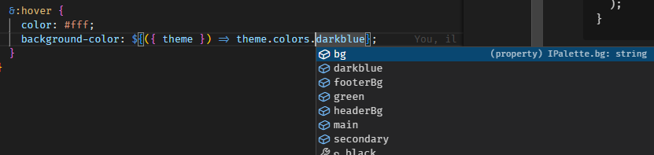

# Gatsby v4 SSG Website


Project is hosted and automatically generated/deployed on Gatsby Cloud Platform.

Some refactoring is still to be made.

## Theming in Styled components

Styled components allows to declare **global styles** (see `src/styles/GlobalStyles.ts`) file.

Then, it can be referenced into the main `Layout` component (see `src/components/Layout.tsx`).

But if we need to re-use some values across the whole application and multiple styled components, we need to centralize these values into a **theme**.

Moreover, we can declare a theme type and **integrate** it into the `styled-components` package.

See `src/styled.d.ts` :

```typescript
import "styled-components";

interface IPalette {
  //...
}

interface ISizes {
  //...
}

interface IBreakpoints {
  //...
}

declare module "styled-components" {
  export interface DefaultTheme { // <-- augment the initial interface with the new attributes : will be available in the whole app
    colors: IPalette;
    sizes: ISizes;
    breakpoints: IBreakpoints;
  }
}
```

We can now use this theme type by creating our own `DefaultTheme` object, and providing it to the whole application.

Theme is created in `src/styles/theme.ts`, and then provided through the use of the `ThemeProvider` component into the main `Layout` component :

> `src/components/Layout.tsx`

```typescript
import React, { ReactChild, ReactChildren } from "react";
import { ThemeProvider } from "styled-components";
import { defaultTheme } from "../styles/theme";

interface LayoutProps {
  children: ReactChild | ReactChildren;
}

export default function Layout({ children }: LayoutProps) {
  return (
    <ThemeProvider theme={defaultTheme}>
      <div id="wrapper">
        <main>{children}</main>
      </div>
    </ThemeProvider>
  );
}
```

Finally, we can consume the theme values anywhere :



## Image optimization w/ Gatsby Plugin Image

### Dynamic images

Into the `gatsby-config.ts` file, we can declare which plugins we want to load into the app.

One of them is `gatsby-source-filesystem`, which we can use to create a new filesystem source. Here I decided to target multiple folders by declaring multiple sources.

So, for instance, if I want to organize the images for the homepage carousel, I can put them in a specific folder and declare it as a source in `gatsby-config.ts` :

```typescript
//...
{
  resolve: "gatsby-source-filesystem",
  options: {
    name: "home-carousel",
    path: "./src/images/home-carousel",
  },
}
//...
```

Once it's declared as a source, we can **query** it from any page using Graphql.

For instance, in the index page, where our home carousel will be, we just have to use `graphql`, exported by `gatsby`, to declare a query that will be automatically executed, and the retrieved data will be injected into the page :

> src/pages/index.tsx

```typescript
import { graphql, PageProps } from "gatsby";
import { GatsbyImage, IGatsbyImageData } from "gatsby-plugin-image";
import * as React from "react";
import { Fade } from "react-slideshow-image";

type DataProps = {
  allFile: {
    edges: {
      node: {
        id: string;
        childImageSharp: {
          gatsbyImageData: IGatsbyImageData;
        };
      };
    }[];
  };
};

const IndexPage = ({ data }: PageProps<DataProps>) => {
  return (
    <Fade>
      {data.allFile.edges.map((img) => (
        <GatsbyImage
          key={img.node.id}
          image={img.node.childImageSharp.gatsbyImageData}
          alt="Alt text"
        />
      ))}
    </Fade>
  );
};

export const query = graphql`
  {
    allFile(filter: { sourceInstanceName: { eq: "home-carousel" } }) {
      edges {
        node {
          id
          childImageSharp {
            gatsbyImageData(
              width: 1900
              aspectRatio: 2
              placeholder: BLURRED
              transformOptions: { cropFocus: SOUTH, fit: COVER }
            )
          }
        }
      }
    }
  }
`;

export default IndexPage;
```

We use the `childImageSharp` field into the query to let Gatsby generate automatically multiple versions of the image, according to the properties we specified into the graphql query (width: 1900, aspect ratio, placeholder, etc...).

Then, the `GatsbyImage` component will take care about generating the appropriate HTML tags and the corresponding `srcset` the browser might need. We just have to tell Gatsby what to retrieve, how to transform/adapt, and then display the resulting image(s).

### Static images

For static images, there is another handy `StaticImage` component that can be used :

```typescript
<StaticImage
  src="../images/logo_transparent.jpg"
  alt="Alt text"
  placeholder="blurred"
  width={logo_dimension}
  height={logo_dimension}
/>
```

## Separating a query in a custom hooks

The `useSiteMetadata` custom hook allows to retrieve site informations from anywhere in the application.

Using Graphql, we retrieve the informations defined in the `gatsby-config.ts` file using the `useStaticQuery` hook from Gatsby.

We can then return an object that will be used by the caller.

> see src/hooks/useSiteMetadata.tsx

## SEO w/ React Helmet

SEO is conveniently taken care of by the `React Helmet` package.

A main `Seo` component is used into the Layout. It defines the base to use for the `head` tag in any HTML page, for instance by defining a `title` template :

```typescript
import React from "react";
import { Helmet } from "react-helmet";
import useSiteMetadata from "../hooks/useSiteMetadata";

export default function Seo() {
  const site = useSiteMetadata();

  return (
    <Helmet titleTemplate={`%s | ${site.title}`} defaultTitle={site.title}>
      //...
    </Helmet>
  );
}
```

Then from any component, we can override the default template :

```typescript
export default function About() {
  return (
    <Helmet>
      <title>A propos</title>
    </Helmet>
  );
}
```

The title will be injected into the template.

> See `src/components/Seo.tsx`
